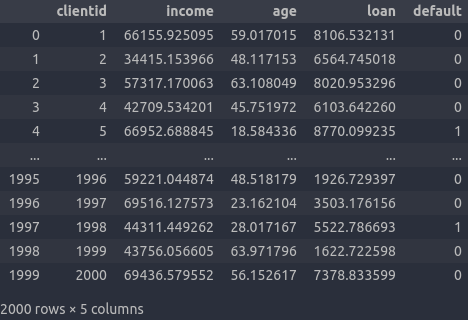
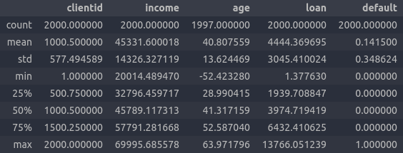
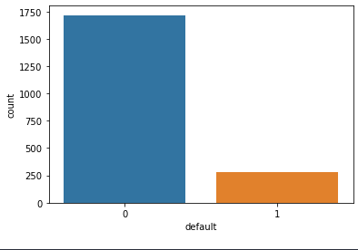
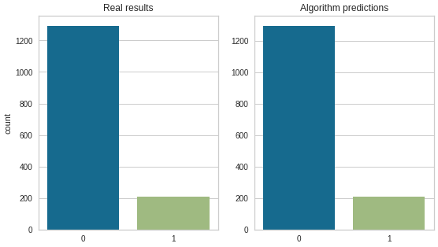

## Credit risk data modelation and predictions with neural networks

---

### Database

#### Link: https://www.kaggle.com/upadorprofzs/credit-risk
#### License: none

---

### Used libraries

- Pandas
- Numpy
- Matplotlib
- Seaborn
- Sklearn
- Pickle
---

### Description

#### This database shows a list of customers with income, age, loan size, and whether they have paid off the loan or not.


#### We have the average 45.33K in incomes, 44.44K in loans and an average age of 40 years.


#### We can see that most people paid[0] the loan comparing to people who don't pay[1]


---

### Changing wrong or non-existent values

#### With `credit_risk.loc[credit_risk['age'] < 0]` we discover that we have 3 registers where the age are negative. To change this I decided to replace these values with the average age of the whole database. We also had missing values, I fixed that too by replacing those values with the average age of the whole database.

---

### Dividing predictors and class

#### I split the database between predictor attributes, now as the variable x, and classifier attributes, now with the variable y.

---

### Tranforming the values with standard scaler

#### I used the standard scale to normalize the database. It basically standardize the database so there isn't too many different values that can hinder the machine learning algorithm. Example: a value of 20000 compared to 10 may seem "better" to the algorithm so this standardization is done.

---

### Dividing the database between train and test

#### After the standard scaler I split the base between training and testing for the algorithm to train and then test it. I used 25% of the database for training.

---

### Using neural networks to predict if the customer will or not pay the loan

#### After pre-processing the data we will create, train and test the neural network. I used the following values for MLPClassifier from sklearn:
```
max_iter=1750, verbose=True, solver='adam', activation='tanh', hidden_layer_sizes=(25, 25)
```
#### We train the algorithm with the database, and create the variable for the neural network to predict whether the client will pay or not pay. We've got an excellent result, 99.67% accuracy score.


#### Classification report:
```
              precision    recall  f1-score   support

           0       1.00      1.00      1.00      1292
           1       0.99      0.99      0.99       208

    accuracy                           1.00      1500
   macro avg       0.99      0.99      0.99      1500
weighted avg       1.00      1.00      1.00      1500
```

#### In the end I saved the classifier, you can find it and use it with the file `neural_network_creditrisk.sav`.
